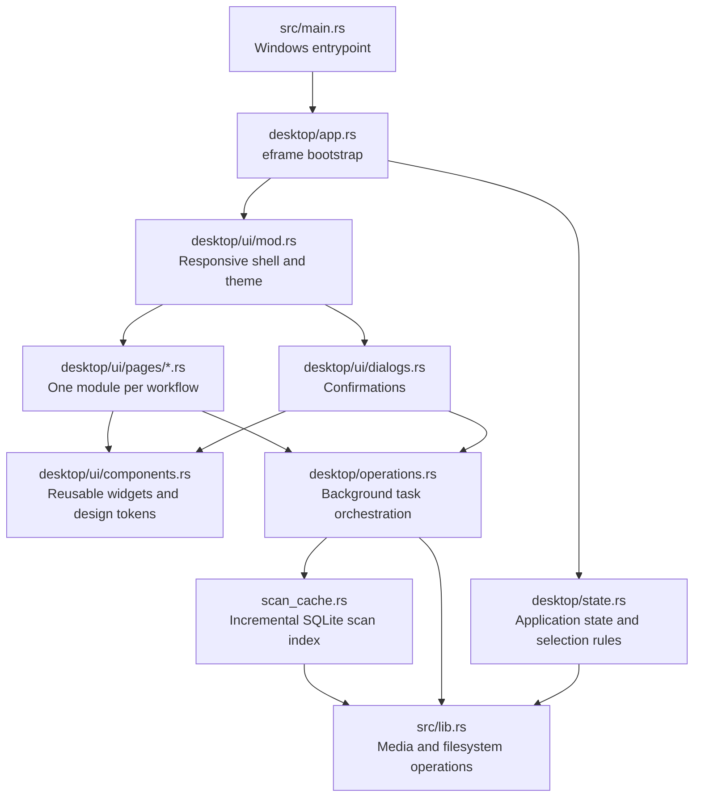

# MediaSift architecture

MediaSift separates testable media operations from the native desktop shell.
The executable entrypoint contains no application behavior; it delegates to the
library crate so desktop state and UI modules can be compiled and tested through
the normal library boundary.

## Module responsibilities

| Module                         | Responsibility                                                                                                        |
| ------------------------------ | --------------------------------------------------------------------------------------------------------------------- |
| `src/main.rs`                  | Select the Windows GUI subsystem and call `desktop::run`.                                                             |
| `src/desktop/app.rs`           | Configure the native window and construct the application.                                                            |
| `src/desktop/state.rs`         | Own UI state, typed work results, notices, and pure duplicate-selection rules.                                        |
| `src/desktop/operations.rs`    | Open native dialogs, start background work, collect typed results, and update state on the UI thread.                 |
| `src/desktop/ui/mod.rs`        | Render global navigation/status chrome, handle shortcuts, configure themes, and dispatch pages.                       |
| `src/desktop/ui/pages/`        | Render each user workflow in its own module without owning filesystem implementation.                                 |
| `src/desktop/ui/dialogs.rs`    | Render confirmations for file-changing actions.                                                                       |
| `src/desktop/ui/components.rs` | Define semantic design tokens and reusable stateless widgets.                                                         |
| `src/desktop/ui/tests.rs`      | Exercise responsive page rendering in light and dark themes.                                                          |
| `src/scan_cache.rs`            | Persist scan generations in Local AppData, reuse unchanged hashes, and restore the last completed review.             |
| `src/lib.rs`                   | Implement testable media discovery, hashing, sorting, renaming, enhancement, archive, recycle, and deletion behavior. |

## Dependency rules

- UI modules may read and update `MediaSiftApp`, but filesystem work belongs in
  `operations.rs` or the core library.
- Long-running work must stay off the eframe event loop and communicate through
  typed `WorkResult` messages. Duplicate scans use a shared atomic cancellation
  token, poll it during traversal and chunked hashing, and report cancellation
  back to the UI as a distinct result rather than an error.
- Incremental scans use SQLite as a disk-backed file index rather than retaining
  every discovered path in the UI process. Each generation records normalized
  paths, sizes, creation and modification timestamps, and SHA-256 hashes. The
  last completed generation remains active until its replacement commits; a
  cancelled, failed, or interrupted refresh cannot erase known-good results.
- A metadata walk remains necessary to detect additions, changes, and removals
  without a permanent file watcher. Incremental scans reuse hashes only when a
  path's metadata fingerprint matches. Full scans deliberately ignore saved
  hashes. Cached reviews are read-only until refreshed in the current session.
- Metadata fingerprints are an optimization, not a destructive-action trust
  boundary. Recycle and permanent-delete workflows re-hash every selected path
  and one retained keeper per affected group immediately before applying the
  action.
- Cache schema, queries, path encoding, and generation lifecycle belong in
  `scan_cache.rs`. UI modules must not open the database directly.
- Reusable visual patterns and semantic colors belong in `components.rs`, not in
  individual workflow pages.
- Cards and banners fill the width assigned by their responsive container.
  Pages may switch between one and two columns at content-based breakpoints,
  but nested vertical scroll areas are prohibited inside the main page scroll;
  they clip unpredictably in egui and can overlap later workflow sections.
- Pure selection or validation behavior belongs in `state.rs` and requires unit
  tests. Rendering behavior belongs in `ui/tests.rs`.
- Duplicate review state uses a sparse set of paths selected for action. The
  safe keep-everything default must not clone every result path. Summary counts
  are cached when a review is created, and the page renderer may materialize at
  most 50 groups per frame. Bulk choices can scan the result set only in direct
  response to a user action.
- A new top-level workflow should add a `Page` variant, a page renderer, and one
  navigation entry. It should not add behavior to `src/main.rs`.
